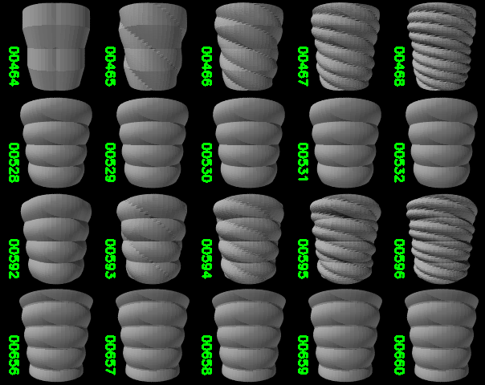

# sinusvase

This is a simple python script to create an stl file for a vase from specified settings, designed primarily for 3D printing. 

Includes the script itself, batch script to create a variety of vases from different settings along a couple of small utility scripts.

